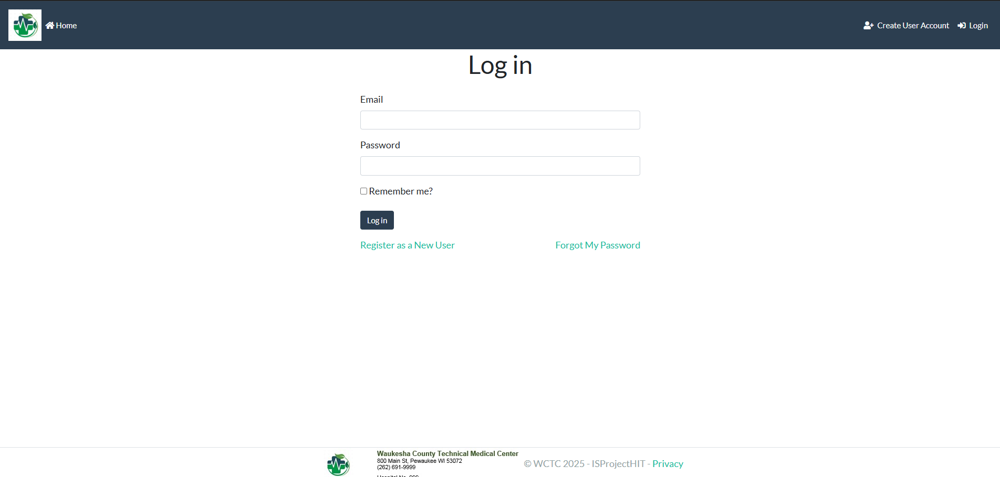
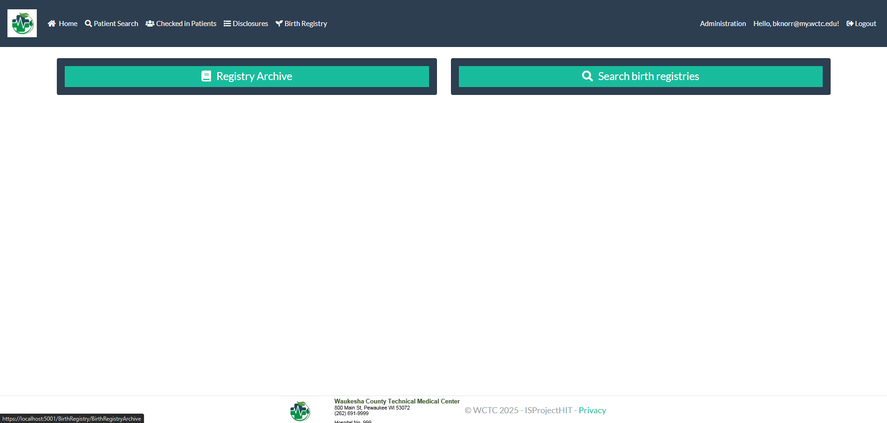
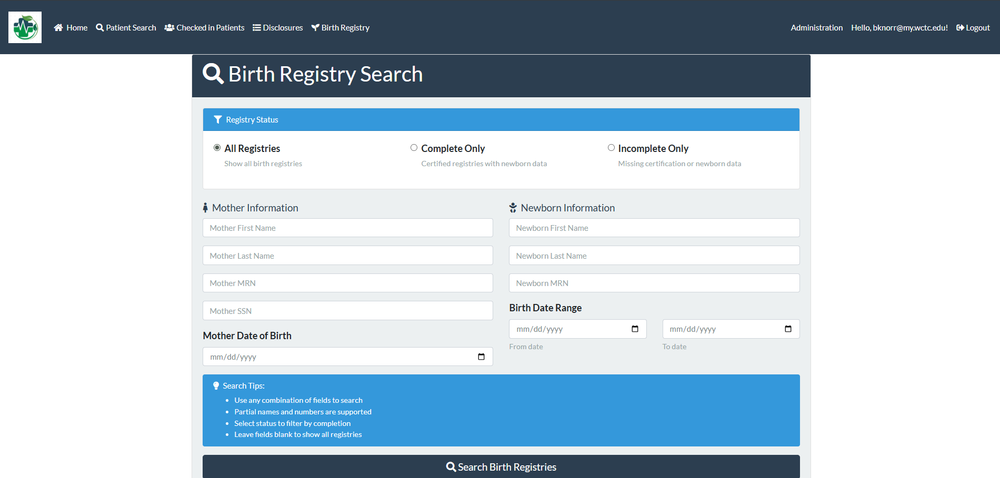
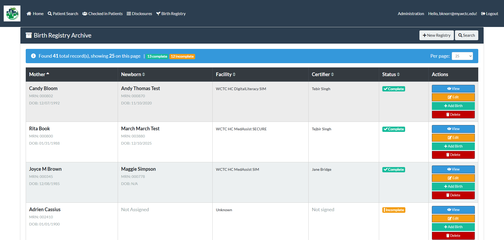
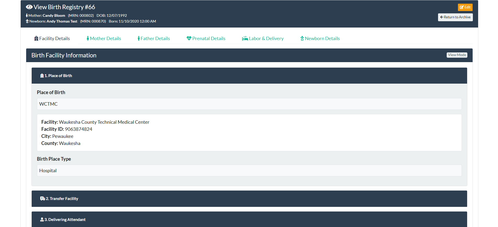
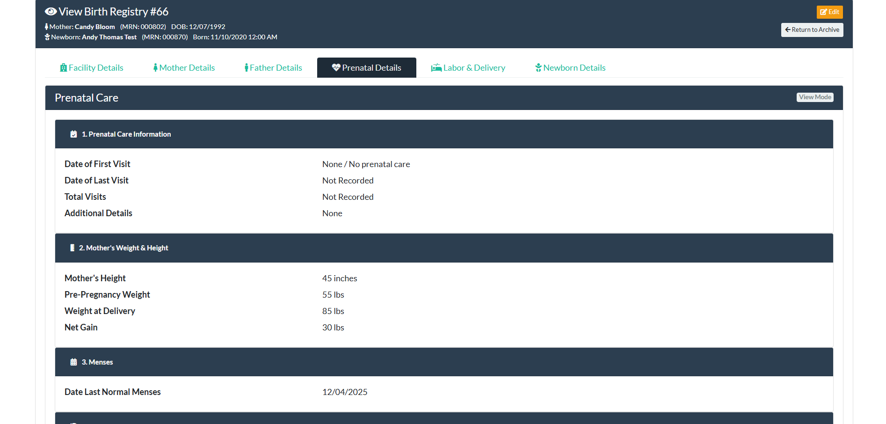
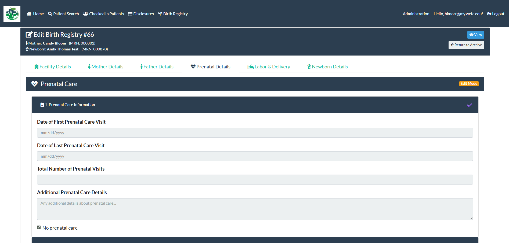
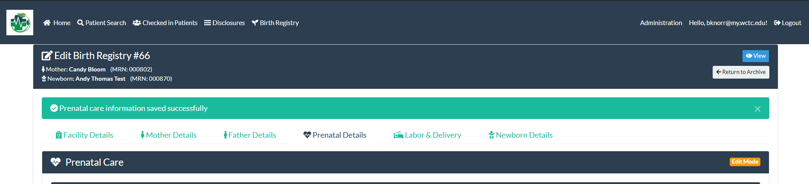
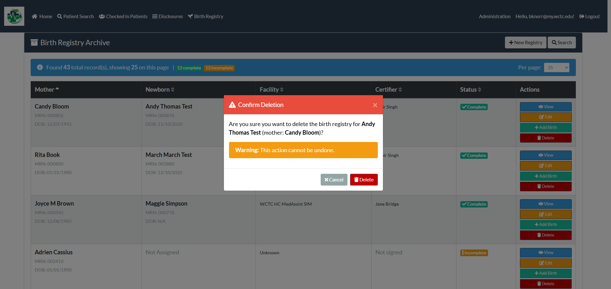

# 🏥 WCTC Healthcare System – Birth Registry Module

**A comprehensive educational module simulating real-world birth registry data entry and management.**

> **Status:** Completed (Fall 2025)
> **Sponsor:** WCTC Health Information Technology (HIT) Program
> **Team:** HIT Birth Registry

---

## 📖 Project Overview

The **Birth Registry Module** is a specialized extension of the existing .NET 8 WCTC Healthcare System. It was designed to provide **Health Information Technology (HIT)** students with a realistic, hands-on environment to practice abstracting and entering complex clinical data.

Birth registry documentation requires precision and adherence to procedural standards. This module simulates the exact workflows found in hospital settings, allowing students to process data from labor and delivery records, parental medical histories, and newborn assessments without the risk of handling real patient data.

---

## 📸 Application Walkthrough

### 1. Access & Navigation
*Secure login ensures only authorized students and faculty can access the registry system. The homepage acts as the central dashboard for all registry actions.*

| Login Screen | Homepage |
| :---: | :---: |
|  |  |

### 2. Patient Search
*To prevent duplicate records, users can search the existing patient database to auto-populate mother and father details before creating a new birth record.*

### 3. Archive & History
*The archive section allows students to review past entries, ensuring that all birth records are properly stored and retrievable for auditing or corrections.*

### 4. Viewing Records
*Detailed read-only views allow registrars to verify data across multiple categories (Facility, Parents, Clinical History, Newborn).*

| View Detail 1 | View Detail 2 |
| :---: | :---: |
|  |  |

### 5. Managing Data (Edit & Delete)
*Students can practice maintaining data integrity by editing existing records to fix errors or deleting invalid entries when necessary.*

| Edit Screen 1 | Edit Screen 2 | Delete Confirmation |
| :---: | :---: | :---: |
|  |  |  |

---

## 🚀 Key Features

* **Integrated Workflows:** Users can search the existing patient database to link records instantly.
* **Realistic Scenarios:** Built to handle exceptions such as home births or cases where only the newborn is being added.
* **Data Validation:** Ensures completeness and compliance with **Wisconsin state reporting requirements** for live births and fetal deaths.
* **Safe Learning Environment:** Students act as registrars using realistic data without privacy risks.

---

## 🛠️ Technology Stack

This project was built upon an existing architecture, maintaining consistency with the core system while introducing new entities and logic.

* **Framework:** [.NET 8](https://dotnet.microsoft.com/en-us/)
* **Frontend:** ASP.NET Core Razor Views
* **Styling:** [Bootstrap 5](https://getbootstrap.com/) (Responsive & Accessible)
* **Database:** SQL Server (via Entity Framework Core)
* **Architecture:** MVC Pattern (Controllers, Services, ViewModels)

---

## 👥 The Team

This project was executed by a four-person student team during the Fall 2025 semester.

* **Brandon Knorr** - *Developer*
* **Mitchell Wayer** - *Developer*
* **Emilee Montijo** - *Developer*
* **Peyton Henrichs-Bowe** - *Developer*

**Product Owner / Faculty Sponsor:**
* **Angela Lee** (WCTC Faculty)

---

## 🧪 Quality Assurance Strategy

We implemented a strict **Definition of Done** to ensure high reliability:

1.  **Individual Verification:** Each feature was tested locally by the assignee.
2.  **Peer Integration Testing:** Code was pulled and tested against the main branch to catch conflicts.
3.  **Third-Party User Testing:** External testers verified usability and interface intuition.
4.  **Product Owner Approval:** Final validation by the sponsor to ensure educational alignment.

---

## 📜 License & Acknowledgements

Developed for **Waukesha County Technical College** as a Capstone/Course Project.
*Special thanks to Angela Lee for guidance on HIT requirements and registry workflows.*
